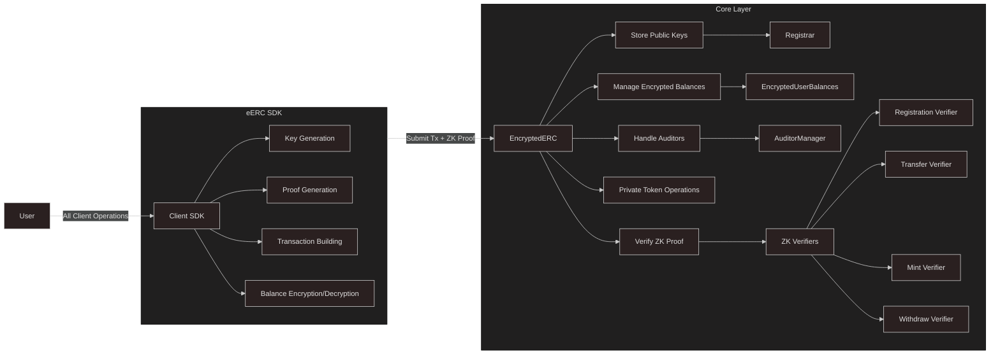

<div  align="center">


</div>

[](https://github.com/ava-labs/EncryptedERC/actions/workflows/ci.yml)
[](https://github.com/ava-labs/EncryptedERC/tree/main/audit)
[](https://docs.avacloud.io/encrypted-erc)

# Encrypted ERC-20 Protocol

The Encrypted ERC-20 (eERC) standard enables secure and confidential token transfers on Avalanche blockchains. Leveraging zk-SNARKs and partially homomorphic encryption, the eERC protocol offers robust privacy without requiring protocol-level modifications or off-chain intermediaries.
AvaCloud API documentation can be found [here](https://docs.avacloud.io/encrypted-erc/getting-started/what-is-encrypted-erc)

## Key features

- **Confidential Transactions**: User balances and transaction amounts remain completely hidden, ensuring financial privacy.

- **Large Integers**: Efficiently handles large token amounts up to 128 bits (2^128), accommodating substantial financial transactions.

- **Client-Side Operations**: Users retain control, performing encryption, decryption, and zk-proof generation directly on their own devices.

- **Fully On-chain Nature**: Operates entirely on-chain without the need for relayers or off-chain actors.

- **Built-in Compliance**: Supports external auditors, ensuring regulatory compliance.

- **Dual-Mode Operation**: Supports both standalone tokens and conversion of existing ERC-20 tokens.

- **Zero-Knowledge Proofs**: Uses zk-SNARKs to validate transactions without revealing sensitive information.

- **Chain Agnostic**: Can be deployed on any EVM-compatible blockchains.

## Architecture

The eERC protocol consists of several key components:

### Core Contracts

- **EncryptedERC** ([contracts/EncryptedERC.sol](contracts/EncryptedERC.sol)): The main contract that implements the privacy-preserving ERC-20 functionality. It handles:

  - Private token operations (mint, burn, transfer)
  - Privacy-preserving balance management
  - Integration with other core components

- **Registrar**: Manages user registration and public key association.

  - Handles user registration
  - Stores public keys
  - Validates user identities
  - Manages registration proofs

- **EncryptedUserBalances**: Handles encrypted balance storage and updates.

  - Stores encrypted balances
  - Manages balance updates in encrypted manner
  - Ensures balance privacy
  - Handles encrypted balance verification

- **TokenTracker**: Manages token registration and tracking.

  - Tracks registered tokens
  - Manages token metadata
  - Handles token blacklisting

- **AuditorManager**: Provides auditor-related functionality for compliance.
  - Manages auditor permissions
  - Stores auditor address with it's public key

### Cryptographic Components

- **BabyJubJub**: Library for elliptic curve operations on the BabyJubJub curve.

- **Zero-Knowledge Circuits**: Circom-based circuits for proof generation and verification.

  - **Registration Circuit**: Validates user registration
  - **Mint Circuit**: Verifies minting operations
  - **Transfer Circuit**: Validates private transfers
  - **Withdraw Circuit**: Verifies withdrawal operations

### Operation Modes

1. **Standalone Mode**:

   - Creates entirely new private ERC-20 tokens
   - Built-in privacy features
   - Direct token operations

2. **Converter Mode**:
   - Adds privacy features to existing ERC-20 tokens
   - Wraps existing ERC20 tokens
   - Enables privacy through deposit/withdraw
   - Maintains compatibility with original tokens

## File structure

- [contracts](#contracts) Smart contract source files

  - `EncryptedERC.sol` - Main contract implementation

  - `Registrar.sol` - User registration management

  - `EncryptedUserBalances.sol` - Encrypted balance handling

  - `tokens/TokenTracker.sol` - Token registration and tracking

  - `auditor/AuditorManager.sol` - Auditor functionality

  - `libraries/BabyJubJub.sol` - Cryptographic operations

  - `types/Types.sol` - Data structures and types

  - `interfaces/` - Contract interfaces

  - `verifiers/` - Zero-knowledge proof verifiers

- [scripts](#scripts) Utility and deployment scripts

- [src](#src) Encryption utilities for TypeScript

- [tests](#tests) Test scripts and helpers

- [circom](#circom) Zero-knowledge proof circuits

## Getting Started

### Prerequisites

You need following dependencies for setup:

- `NodeJS >= v22.x`

- `Circom >= 2.1.9`

### Installation

1. Clone the repo

```sh
git clone https://github.com/ava-labs/EncryptedERC.git
```

2. Install NPM packages

```sh
npm install
```

3. Compile the contracts

```sh
npx hardhat compile
```

4. Compile Circuits

```sh
npx hardhat zkit make --force # compiles circuits
npx hardhat zkit verifiers    # generates verifiers
```

## Deployment (Local)

### Standalone

The Standalone version lets users create entirely new private ERC-20 tokens with built-in privacy, supporting confidential minting and burning.

1. Start the local node

```sh
npx hardhat node
```

2. Deploy the contract

```sh
npx hardhat run scripts/deploy-standalone.ts --network localhost
```

Refer to the [scripts/deploy-standalone.ts](scripts/deploy-standalone.ts) script for deployment examples.

### Converter

The Converter version adds privacy features to existing ERC-20 tokens, enabling users to convert standard ERC-20 tokens to private ones and switch between public and private states through deposit and withdrawal functions.

1. Start the local node

```sh
npx hardhat node
```

2. Deploy the contract

```sh
npx hardhat run scripts/deploy-converter.ts --network localhost
```

Refer to the [scripts/deploy-converter.ts](scripts/deploy-converter.ts) script for deployment examples.

## Architecture Overview



## Run Tests/Coverage

Contract tests:

```sh
npx hardhat test
```

Coverage report:

```sh
npx hardhat coverage
```

## 📊 Efficiency Overview

### ⛽ Avg. On-Chain Gas Costs (Avalanche C-Chain Mainnet)

```sh
······················································································································································································
|  Solidity and Network Configuration                                                                                                                                                │
·································································································|·················|···············|·················|································
|  Solidity: 0.8.27                                                                              ·  Optim: true    ·  Runs: 200    ·  viaIR: false   ·     Block: 30,000,000 gas     │
·································································································|·················|···············|·················|································
|  Network: AVALANCHE                                                                            ·  L1: 0.14345 gwei               ·                 ·        16.36 usd/avax         │
·································································································|·················|···············|·················|················|···············
|  Contracts / Methods                                                                           ·  Min            ·  Max          ·  Avg            ·    calls       ·  usd (avg)   │
·································································································|·················|···············|·················|················|···············
|  EncryptedERC                                                                                  ·                                                                                   │
·································································································|·················|···············|·················|················|···············
|      deposit(uint256,address,uint256[7])                                                       ·         71,680  ·      841,771  ·        564,892  ·            16  ·           △  │
·································································································|·················|···············|·················|················|···············
|      privateBurn(((uint256[2],uint256[2][2],uint256[2]),uint256[32]),uint256[7])               ·        890,507  ·    1,227,920  ·      1,028,678  ·             4  ·           △  │
·································································································|·················|···············|·················|················|···············
|      privateMint(address,((uint256[2],uint256[2][2],uint256[2]),uint256[24]))                  ·        712,316  ·      760,624  ·        722,016  ·            10  ·           △  │
·································································································|·················|···············|·················|················|···············
|      setAuditorPublicKey(address)                                                              ·              -  ·            -  ·        103,851  ·             4  ·           △  │
·································································································|·················|···············|·················|················|···············
|      setTokenBlacklist(address,bool)                                                           ·              -  ·            -  ·         46,443  ·             1  ·           △  │
·································································································|·················|···············|·················|················|···············
|      transfer(address,uint256,((uint256[2],uint256[2][2],uint256[2]),uint256[32]),uint256[7])  ·        947,295  ·      947,331  ·        947,313  ·             4  ·           △  │
·································································································|·················|···············|·················|················|···············
|      withdraw(uint256,((uint256[2],uint256[2][2],uint256[2]),uint256[16]),uint256[7])          ·        775,186  ·      828,341  ·        796,263  ·             6  ·           △  │
·································································································|·················|···············|·················|················|···············
|  Registrar                                                                                     ·                                                                                   │
·································································································|·················|···············|·················|················|···············
|      register(((uint256[2],uint256[2][2],uint256[2]),uint256[5]))                              ·        322,114  ·      322,150  ·        322,143  ·            20  ·           △  │
·································································································|·················|···············|·················|················|···············
|  Deployments                                                                                                     ·                                 ·  % of limit    ·              │
·································································································|·················|···············|·················|················|···············
|  BabyJubJub                                                                                    ·              -  ·            -  ·        447,616  ·         1.5 %  ·           △  │
·································································································|·················|···············|·················|················|···············
|  EncryptedERC                                                                                  ·      3,704,671  ·    3,729,773  ·      3,717,222  ·        12.4 %  ·        0.01  │
·································································································|·················|···············|·················|················|···············
|  MintCircuitGroth16Verifier                                                                    ·              -  ·            -  ·      1,690,470  ·         5.6 %  ·           △  │
·································································································|·················|···············|·················|················|···············
|  Registrar                                                                                     ·              -  ·            -  ·        508,067  ·         1.7 %  ·           △  │
·································································································|·················|···············|·················|················|···············
|  RegistrationCircuitGroth16Verifier                                                            ·              -  ·            -  ·        810,848  ·         2.7 %  ·           △  │
·································································································|·················|···············|·················|················|···············
|  TransferCircuitGroth16Verifier                                                                ·              -  ·            -  ·      2,052,092  ·         6.8 %  ·           △  │
·································································································|·················|···············|·················|················|···············
|  WithdrawCircuitGroth16Verifier                                                                ·              -  ·            -  ·      1,319,158  ·         4.4 %  ·           △  │
·································································································|·················|···············|·················|················|···············
|  Key                                                                                                                                                                               │
······················································································································································································
|  △  Cost was non-zero but below the precision setting for the currency display                                                                                                     │
······················································································································································································
```

## Security Audits

1. **Circom Audit**

   - Date: March 2025
   - Scope: Circom circuits for various zero-knowledge proofs
   - Report: [avacloud-eerc-circom-audit.pdf](audit/avacloud-eerc-circom-audit.pdf)

2. **Gnark Audit**
   - Date: March 2025
   - Scope: Core protocol and Gnark circuits for zero-knowledge proofs
   - Report: [avacloud-eerc-audit.pdf](audit/avacloud-eerc-audit.pdf)

## Security Considerations

- **Auditor Integration**: The protocol includes built-in auditor functionality for compliance.

- **Blacklisting**: Supports optionalblacklisting for security purposes.

### Notes

For production deployments, set `isProd` to `true` in the deployment scripts to use the production verifiers. These verifiers use secure trusted setups from the [zkevm](https://github.com/iden3/snarkjs?tab=readme-ov-file#7-prepare-phase-2).

Corresponding `zkey` and `verification_key.json` files are present in the `circuits/build` directory. After compiling circuits present in the `circuits` folder, and downloading the proper `.ptau` files, these can be verified using the `snarkjs` tool with the following command:

```sh
snarkjs zkey verify <circuit_name>.r1cs powersOfTau28_hez_final_<Size>.ptau <circuit_name>.zkey
```

- For transfer/mint circuit => `powersOfTau28_hez_final_15.ptau`
- For withdraw circuit => `powersOfTau28_hez_final_14.ptau`
- For registration circuit => `powersOfTau28_hez_final_11.ptau`


## License

This project is licensed under the Ecosystem License - see the LICENSE file for details.
